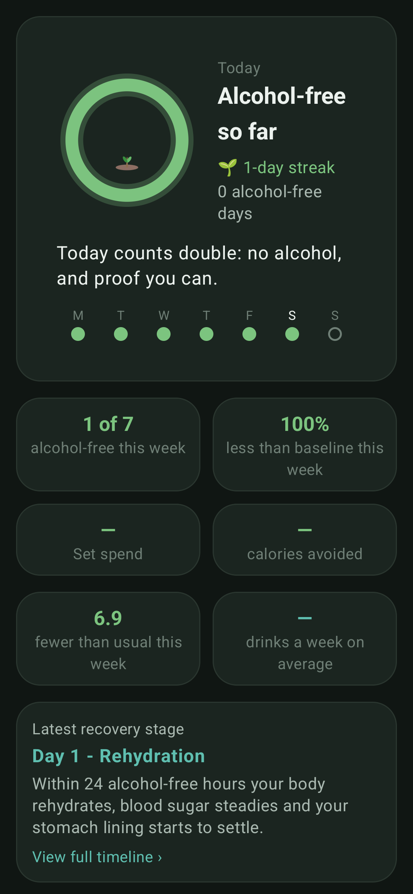
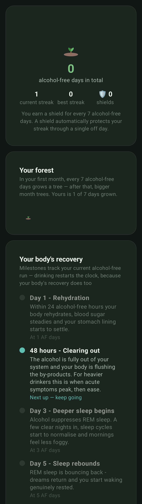
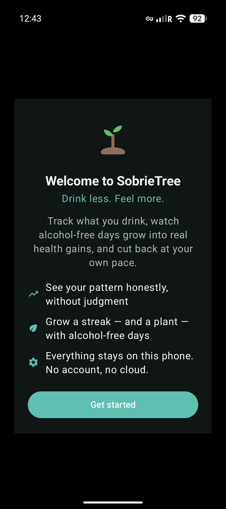
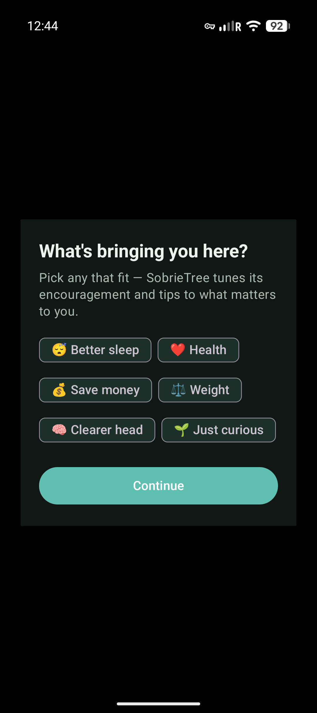
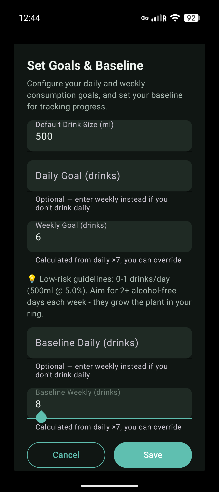
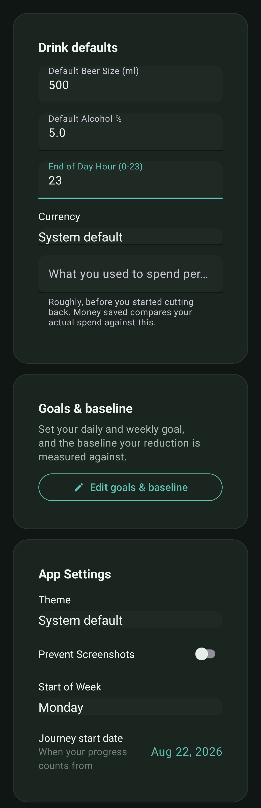
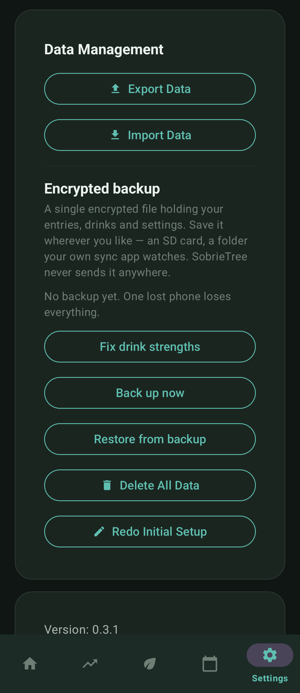
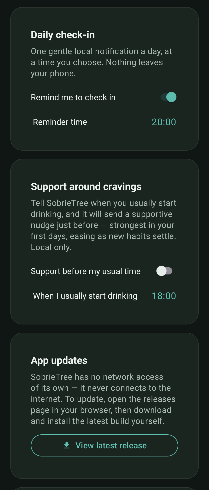

# 🌳 SobrieTree

**Drink less. Feel more.**

An Android app for drinking less, that keeps everything on your phone.

No account. No cloud. No analytics. The app holds **no network permission at all** — not "we promise not to look", but *it cannot connect to the internet*, enforced by the manifest.

<p align="center">
  
  &nbsp;
  
</p>

---

## What it's like to use

### The ring empties, it doesn't fill

Most trackers reward you for adding things. Here the ring starts **full** each day and depletes as you log. An untouched day is a complete circle, and a small plant grows in the middle of it. There is nothing to earn by opening the app — only something to keep.

### Alcohol-free days grow trees you keep

Seven dry days in your first month grow a tree; after that they take a month each. Finished trees join a forest that never shrinks — a lapse costs you the sapling in progress, never the woodland behind it.

### Streaks that forgive

Every seven alcohol-free days earns a **shield**, and a shield carries your streak through a single off day automatically. Cutting down is not a clean line, and a counter that resets to zero on one bad Friday teaches you to stop logging.

### Your body's recovery, keyed to the run you're actually on


Rehydration at 24 hours, REM sleep returning around day five, blood pressure easing around three weeks, the measurable shifts a month brings. Each milestone says what is happening and why.

The timeline follows your **current unbroken run**, not your lifetime total — drinking restarts the clock, because your body's recovery does too. Shields still bridge a single lapse, as they do everywhere else.

<br clear="right">

### Honest numbers, not flattering ones

Savings and streaks only count **completed** days, so nothing appears out of thin air at midnight. "Money saved" is measured against what you say you *used* to spend per week, and shows the whole sum — what you'd have spent, what you actually spent — so a zero explains itself instead of looking broken.

Your week is also reported in **UK units**, against the guideline the app quotes at you: no more than 14 a week, spread over three or more days. Volume drives goals and streaks because those are set in drinks; units are what health guidance is written in, so both exist. A 500 ml glass of 12% wine is one drink and six units, and the app will not pretend otherwise.

### Logging that stays out of your way

Tap a saved drink on Home, or the home-screen **widget**, and it's logged. The widget then offers a 60-second **Undo**, because one-tap logging with no confirmation is exactly how you end up with drinks you never had.

Managing your saved drinks never logs anything — that's a separate screen, on purpose.

---

## The screens

| | |
|---|---|
|  | **Welcome.** What the app does, and where your data lives, before you commit to anything. |
|  | **What brings you here.** Sleep, health, money, weight, a clearer head — or just curious. Encouragement and the reading list tune to what you pick. |
|  | **Goals & baseline.** Daily or weekly, whichever fits how you drink. The baseline is what your reduction is measured against; low-risk guidance sits right beside the field. |
|  | **Home.** Today's ring, the week's dots, your headline numbers and the recovery stage you're on. |
|  | **Journey.** The forest, streaks and shields, the recovery timeline, what you've saved, and short cited reads. |
|  | **Settings.** Drink defaults, the weekly spend that powers "money saved", when your day ends, when your week starts, and the date your progress counts from. |

**Stats** adds the same figures over five windows — this week, last week, this month, the last 30 days, since you started — each carrying the span it covers, because "12 drinks" means nothing until you know whether that's three days or thirty. **Calendar** is where you review and fix past days.

---

## 🔒 Privacy

| | |
|---|---|
| **No network permission** | `INTERNET` is stripped from the merged manifest, so neither the app nor any library it links can reach the network. |
| **No account, no cloud, no analytics** | There is no server. There is nothing to sign into. |
| **Screenshot blocking** | On by default, so the app doesn't show up in the recents switcher or screen recordings. |
| **Private notifications** | Lock-screen text stays generic; the detail is only visible once unlocked. |
| **Android backup disabled** | `allowBackup="false"` keeps your drinking history out of Google's cloud backup. |
| **Local reminders only** | Notifications are scheduled on-device by WorkManager. |

### Encrypted backup



Because nothing syncs, a lost phone would otherwise lose everything — and the plain CSV export leaves your drinking history readable in Downloads.

**Back up now** writes a single encrypted file wherever you point it: an SD card, a folder your own sync client watches. AES-256-GCM, keyed from your passphrase with PBKDF2-HMAC-SHA256 at 210,000 iterations, with a fresh salt and IV per backup — so two backups of identical data share no bytes, and a watcher of a synced folder can't tell whether anything changed.

The passphrase is asked for when it's needed and **never stored**, so nothing on the device can open its own backups. That also means there is no automatic schedule: an unattended backup would need the passphrase sitting next to the file.

Restore is additive and idempotent — entries already present are left alone — so restoring twice, or onto a phone you've used since, can't duplicate or overwrite a history.

<br clear="right">

### Updating



The app can't check for updates, because it can't reach the network. **View latest release** opens the releases page in your browser; you download and install the build yourself.

The daily check-in and the craving-time nudge are local notifications, scheduled one firing at a time so they hold to the minute you set — including across a daylight-saving change.

<br clear="right">

---

## Install

Grab the APK from the [latest release](https://github.com/phrag/SobrieTree/releases/download/latest/SobrieTree-latest.apk), or from the [releases page](https://github.com/phrag/SobrieTree/releases).

Android 7.0 (API 24) or newer. You'll need to allow installing from your browser or file manager.

Every release is signed with a key that lives only in CI secrets — never in this repository.

---

## Architecture

**Pure-Kotlin engine** (`android/app/src/main/java/com/sobrietree/android/engine/`) — all the logic that decides anything, with no `android.*` imports, so it runs on a plain JVM and is tested there.

| | |
|---|---|
| `DayLedger` | Per-day totals in both volume and units; the substrate everything else reads |
| `StreakEngine` | Streaks, shields, trees |
| `MetricsEngine` · `StatsEngine` | Goal and baseline comparisons; the windowed figures on Stats |
| `UnitsEngine` | UK units and the low-risk guideline |
| `SavingsEngine` | Money and calories not spent |
| `HealthTimeline` · `EducationLibrary` | Recovery milestones and the cited reads |
| `BackupCrypto` | AES-256-GCM and a hand-rolled PBKDF2 (the JCE name is API 26+; minSdk here is 24) |
| `DailySchedule` · `HighRiskSupport` | Notification timing and craving-window support |
| `AbvRepair` | Finds drinks logged at a placeholder strength and proposes the real one |

**Android layer** — activities bind an immutable state snapshot from `GamificationManager`; views like `GrowthRingView` and `ForestView` only draw.

**Native core** (`rust/src/lib.rs`) — SQLite storage exposed to Kotlin over JNI.

---

## Build

Requires JDK 17+, the Android SDK (NDK + CMake), the Rust toolchain, and `cargo-ndk`.

```bash
# 1. Rust core → jniLibs
cd rust
cargo ndk -t arm64-v8a -o ../android/app/src/main/jniLibs build --release

# 2. Android app
cd ../android
./gradlew assembleDebug
```

Output: `android/app/build/outputs/apk/debug/SobrieTree-<version>.apk`.

### Tests

```bash
cd android && ./gradlew testDebugUnitTest   # includes the engine layer
cd rust    && cargo test --all
```

The engine suite is the part worth reading. Unit conversions are pinned to the published worked examples rather than to my own arithmetic; the PBKDF2 implementation is checked against standard test vectors; the notification schedule is walked an hour at a time across a fortnight to prove it never drifts.

### Signing

No keystore or password lives in this repository. Signing config is read from **either** a gitignored `android/keystore.properties` **or** `SIGNING_*` environment variables (CI secrets):

```properties
storeFile=/absolute/path/to/sobrietree-release.jks
storePassword=…
keyAlias=sobrietree
keyPassword=…
```

With no key configured the build falls back to the debug key and CI skips publishing, so an unsigned build can never reach the releases page.

### Continuous integration

`.github/workflows/ci.yml` runs on every push: builds the Rust core with `cargo-ndk`, assembles the APK, runs the Android and Rust test suites, checks `cargo fmt` / `clippy` and Android Lint, uploads the APK artifact, and — when signing secrets are present — publishes the rolling `latest` release.

---

## Project structure

```
├── android/app/src/main/java/com/sobrietree/android/
│   ├── MainActivity.kt          # Home: ring, tiles, recovery stage, logging
│   ├── ProgressActivity.kt      # Stats: windowed figures, units, trend chart
│   ├── JourneyActivity.kt       # Forest, recovery timeline, badges, savings, reads
│   ├── CalendarActivity.kt      # Review and edit past days
│   ├── SettingsActivity.kt      # Goals, spend, reminders, backup, privacy
│   ├── SobrieTreeWidget.kt      # Home-screen ring + one-tap logging with undo
│   ├── GrowthRingView.kt        # The depleting ring
│   ├── TreePainter.kt / ForestView.kt
│   ├── GamificationManager.kt   # Engine state → UI state
│   └── engine/                  # Pure-Kotlin, JVM-tested logic
├── rust/src/lib.rs              # JNI + SQLite core
└── .github/workflows/ci.yml
```

---

## A note on scope

SobrieTree is a tracking and motivation tool, not treatment.

It follows the WHO position that no level of alcohol consumption is risk-free, and the UK Chief Medical Officers' low-risk guideline (2016), as published by the NHS: no more than 14 units a week, spread over three or more days. Health claims in the app carry their source.

If alcohol is causing you harm, or you experience physical withdrawal, please talk to a doctor — stopping suddenly can be dangerous without support.

## License

See the repository for license details.
